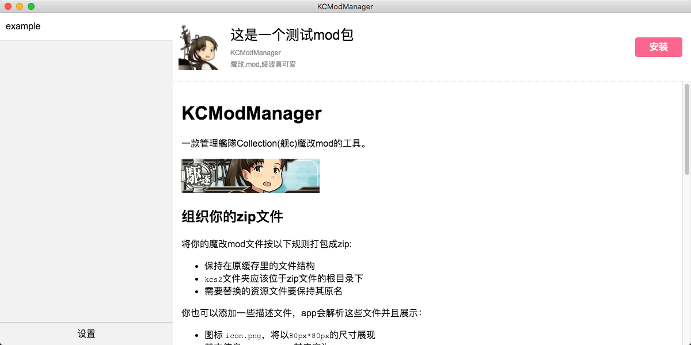

# KCModManager

[](https://travis-ci.org/xiaozhikang0916/kcmodmanager)
[](https://ci.appveyor.com/project/xiaozhikang0916/kcmodmanager/branch/master)

A tool to manage Mods package of 艦隊Collection(Kancolle)

It is only to manage you mod files, does not provide local-cache feature of the game.

[中文简介](./README-ch.md)



## Build

Developed in [Electron](https://electronjs.org/) 2.0.8

To build by yourself, run :

```bash
git clone git@github.com:xiaozhikang0916/kcmodmanager.git

cd kcmodmanager

//Node.js and npm are required

npm install

npm start
```

## Manage your zip package

Package your mod files in zip following rules:

* Keep the architacture of what it is in cache
* Directory `kcs2` should be in the root of you zip
* Keep the original name of modified resource file

Also, you can add some description files, which will be resolved by this app:

* An `icon.png` file, will be resolved as `80px*80px`
* An `info.json` file containing basic info of your mod, the content may have:
  * `title` a string
  * `author` a string
  * `tags` list of strings

A valid `info.json` file:

```json
{
    "name": "A KanColle Mod",
    "author": "KCModManager",
    "tags": [
        "mod",
        "KanColle",
        "Tanaka"
    ]
}
```

Informations from previous two files will be displayed in the top of info-panel

Additionally, you can put a `readme.md` file with it's referencing content in folder `readme` using relative path in the root of your zip (typically, some pic resources), such content will display in the bottom of info-panel.

It should look like:

```
your_mod.zip
    |
    - icon.png
    |
    - info.json
    |
    - readme.md
    |
    - readme
    |   |
    |   - screenshot.png
    |
    -- kcs2
        |
        -- img
            |
            -- ...
            |
            -- modified_file.png
```

You can get an example zip file in [./instruction/example.zip](./instruction/example.zip)

## How to use

Open this app, complete the setting window if it is first time to start.

* Path to your mod zip files
* Path to your local game cache
> `kcs2` should located in the root of your local game cache
* Output format of resource files
> Use placeholder `{name}` and `{ext}`, default is `{name}.hack.{ext}`. Try **NOT** to use `{name}.{ext}` since it would overwrite the origin cache file.

Close setting window to save.

## TOLO LIST

* Save the modified files list to config of each mod package
  * Handle the situation if two mods are modifying the same resource file
* Support a `README` file in zip to display some instruction
* Improve the UI

## LICENCE

Under licence [MIT](./LICENCE)
